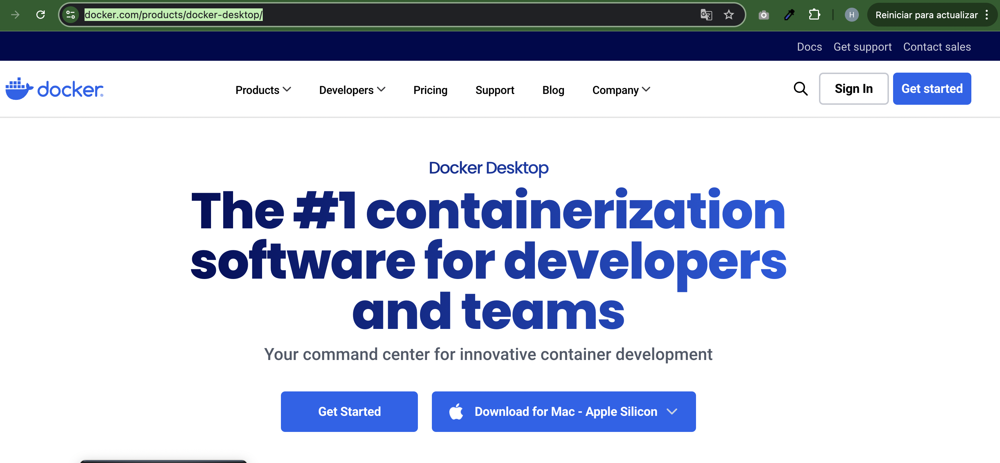
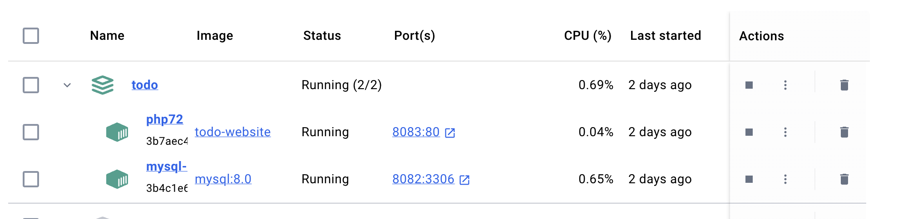
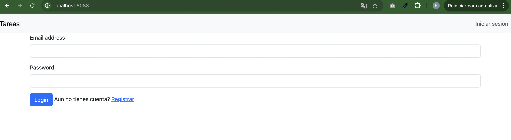

# Prueba para programador en la empresa Fonsecantero

## Requirements

Docker file para PHP 7.2 y MySQL 8.0

## Installation

Descargar docker dependiendo el sistema operativo:

https://www.docker.com/products/docker-desktop/

se veria como la imagen siguiente:



Para la instalacion es necesario correr el siguiente comando

````
docker-compose up -d

````

Asi se verian los servicios como la siguiente imagen:



Esto hara que se levante los servicios de docker se podria ver asi pero la diferencia es que seria fonsecantero en lugar de todo
Ya teniendo los servicios corriendo podriamos copiar o importar el archivo todo.sql en la base de datos: todo
la configuracion de la bd es la siguiente:

```
host: localhost o 127.0.0.1
database: todo
user: usr_todo
password: 123
Puerto: 8082
```

Una vez agregado lo siguiente es dirigirnos a la url:

http://localhost:8083/

Donde veriamos lo siguiente:



Y listo! Ya puedes registrar tu usuario , hacer login y agregar tus tareas.